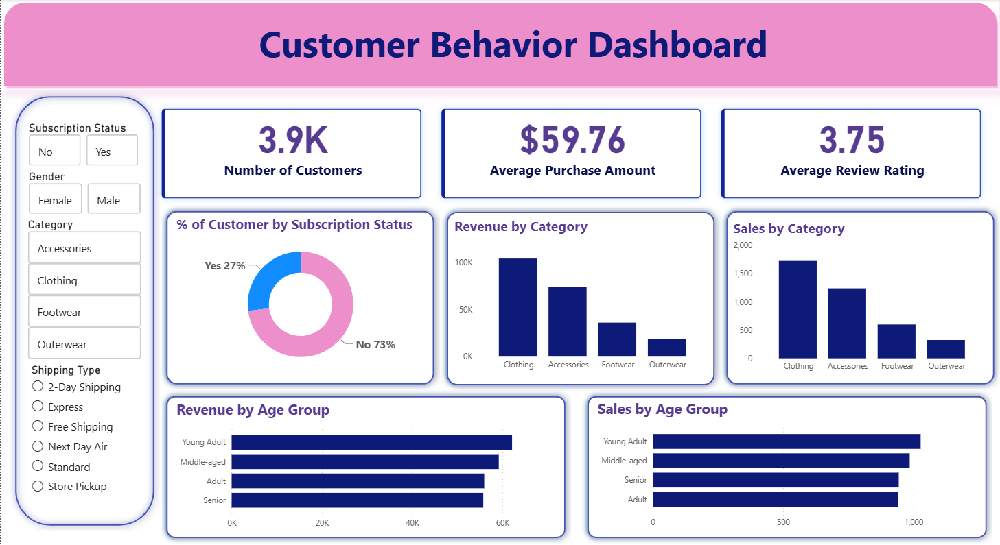

#  Customer Shopping Behavior Analysis

##  Project Overview

Customer Shopping Behavior Analysis is an end-to-end **Data Analytics Project** that explores purchasing patterns, customer demographics, subscription behavior, and product preferences using transactional shopping data.

This project combines **Python (Pandas)** for data cleaning and preprocessing, **MySQL** for business analysis, and **Power BI** for interactive visualization to generate actionable business insights.

---

##  Business Problem

Retail businesses collect large amounts of customer transaction data but often struggle to transform it into actionable insights.

This project aims to answer questions such as:

* Which customer groups generate the highest revenue?
* Which products receive the best ratings?
* How do discounts affect customer spending?
* Are subscribers more valuable than non-subscribers?
* Which age groups contribute the most revenue?
* Which products depend heavily on discounts?

---

##  Dataset Information

| Attribute     | Value     |
| ------------- | --------- |
| Total Rows    | **3,900** |
| Total Columns | **18**    |

### Features

* Customer Demographics
* Purchase Information
* Product Category
* Purchase Amount
* Review Rating
* Subscription Status
* Shipping Type
* Discount Applied
* Previous Purchases
* Purchase Frequency
* Location

---

##  Tech Stack

* **Python (Pandas)** → Data Cleaning & Feature Engineering
* **MySQL** → SQL Business Analysis
* **Power BI** → Dashboard & Data Visualization
* **Jupyter Notebook** → Data Cleaning Workflow

---

##  Repository Structure

```text
Customer-Shopping-Behavior-Analysis/
│
├── Dataset/
│   └── customer_shopping_behavior.csv
│
├── Notebooks/
│   └── Data Cleaning.ipynb
│
├── SQL/
│   └── business insights.sql
│
├── Power BI/
│   └── Customer_behavior_dashboard.pbix
│
├── images/
│
└── README.md
```

---

## 🔄 Project Workflow

```text
Raw Dataset
      │
      ▼
Data Cleaning (Python)
      │
      ▼
Feature Engineering
      │
      ▼
MySQL Business Analysis
      │
      ▼
Power BI Dashboard
      │
      ▼
Business Recommendations
```

---

## 🧹 Data Cleaning & Preprocessing

* Imported dataset using Pandas
* Checked dataset structure and summary statistics
* Handled missing values in **Review Rating**
* Standardized column names
* Created **Age Group** feature
* Created **Purchase Frequency** feature
* Removed redundant columns
* Loaded cleaned dataset into MySQL

---

##  SQL Business Analysis

The following business questions were answered:

* Revenue by Gender
* High Spending Discount Users
* Top 5 Products by Rating
* Shipping Type Comparison
* Subscribers vs Non-Subscribers Analysis
* Discount-Dependent Products
* Customer Segmentation
* Top 3 Products by Category
* Repeat Buyer Subscription Analysis
* Revenue by Age Group
All insights are added in images folder
---

##  Power BI Dashboard

The dashboard provides:

*  Total Customers 
*  Average Purchase Amount
*  Average Review Rating
*  Revenue by Category
*  Sales by Category
*  Revenue by Age Group
*  Sales by Age Group
*  Subscription Status Analysis
*  Interactive Filters & Slicers

---

##  Key Business Insights

* Revenue contribution differs across customer genders.
* Certain products consistently receive higher customer ratings.
* Express shipping users tend to spend more on average.
* Loyal customers contribute significantly to total revenue.
* Young adults generate the highest revenue among all age groups.
* Some products rely heavily on discounts to drive sales.

---

##  Business Recommendations

* Improve subscription programs with exclusive benefits.
* Strengthen customer loyalty programs.
* Optimize discount strategies to maximize profitability.
* Promote highly-rated products through marketing campaigns.
* Target high-value customer segments with personalized offers.

---

##  Dashboard Preview



---

##  Skills Demonstrated

* Data Cleaning
* Feature Engineering
* SQL Query Writing
* Exploratory Data Analysis (EDA)
* Customer Segmentation
* Business Analytics
* Data Visualization
* Power BI Dashboard Development
* Data Storytelling

---

##  Author

**Sadashray Rastogi**

**Aspiring Data Analyst | SQL | Python | Power BI | Data Visualization**

---

⭐ **If you found this project useful, consider giving it a Star!**
